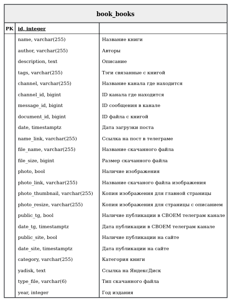

<h1 align="center">Dark Universe Project</h1>

<p align="center">
    
    
    
    
    
</p>

<p align="center">
    <a target="_blank" href="https://t.me/Imbestmanofplanet" title="Telegram">
        
    </a> 
</p>

<h2 align="center"></h2>

<p align="justify">
Проект сайта технической литературы с адаптивной вёрсткой, поддерживающий устройства с разрешением экрана до 320px написанный на фреймворке Django + PostgreSQL 10.
    
Основная идея проекта - связать поисковые системы с ресурсами Telegram.
Для этой задачи написан парсер телеграм-каналов который занимается наполнением контента: [TeleGramParser](https://github.com/kuusee/TeleGramParser).
</p>

<h2 align="center"></h2>
    <p align=center>
        <a target="_blank" href="http://89.223.65.146/">Пример реализации проекта</a>
    </p>
<h2 align="center"></h2>
<h2 align="center">Стек</h2>

Django, PostgreSQL 10, Gunicorn, Nginx

<h2 align="center">Проблемы</h2>

- Функционал админ-панели стандартный, следовательно при удалении/редактировании/создании контента может пойти что-то не так=)... Выход из данной ситуации - использование программ для работы с БД (например, pgAdmin);

- Точный поиск(который в выпадающем меню) на данный момент работает не эффективно;

<h2 align="center">Структура БД</h2>

<details>
    <summary>Структура БД</summary>
        <p align=center>
            
        </p>
</details>

<h2 align="center">Установка</h2>
Установка производилась на сервере с чистой ОС Ubuntu 18.04.

***Из терминала заходим на удаленный сервер:***

1) **Создаем пользователя:**

    ```
    $ adduser your_username
    $ usermod -aG sudo your_username
    $ su your_username
    ```


2) **Проверяем локали:**

    Использовался материал:
    [ссылка1](https://tokmakov.msk.ru/blog/item/466),
    [ссылка2](https://qna.habr.com/q/824801)

    `
    $ locale
    `

    Если вывод совпадает с этим:

    ```
    LANG=ru_RU.UTF-8
    LANGUAGE=en_US:
    LC_CTYPE="ru_RU.UTF-8"
    LC_NUMERIC="ru_RU.UTF-8"
    LC_TIME="ru_RU.UTF-8"
    LC_COLLATE="ru_RU.UTF-8"
    LC_MONETARY="ru_RU.UTF-8"
    LC_MESSAGES="ru_RU.UTF-8"
    LC_PAPER="ru_RU.UTF-8"
    LC_NAME="ru_RU.UTF-8"
    LC_ADDRESS="ru_RU.UTF-8"
    LC_TELEPHONE="ru_RU.UTF-8"
    LC_MEASUREMENT="ru_RU.UTF-8"
    LC_IDENTIFICATION="ru_RU.UTF-8"
    LC_ALL=
    ```
    можно переходить к п.3.

    Если не совпадает:
    ```
    $ sudo apt install locales-all
    $ sudo locale-gen en_US.UTF-8 ru_RU.UTF-8
    $ sudo update-locale LANG=ru_RU.UTF-8
    $ su root
    $ su your_username
    $ locale
    ```
    После этих действий вывод должен быть:
    ```
    LANG=ru_RU.UTF-8
    LANGUAGE=en_US:
    LC_CTYPE="ru_RU.UTF-8"
    LC_NUMERIC="ru_RU.UTF-8"
    LC_TIME="ru_RU.UTF-8"
    LC_COLLATE="ru_RU.UTF-8"
    LC_MONETARY="ru_RU.UTF-8"
    LC_MESSAGES="ru_RU.UTF-8"
    LC_PAPER="ru_RU.UTF-8"
    LC_NAME="ru_RU.UTF-8"
    LC_ADDRESS="ru_RU.UTF-8"
    LC_TELEPHONE="ru_RU.UTF-8"
    LC_MEASUREMENT="ru_RU.UTF-8"
    LC_IDENTIFICATION="ru_RU.UTF-8"
    LC_ALL=
    ```
    и выполняем:
    ```
    $ locale | sudo tee /etc/default/locale
    $ cat /etc/default/locale
    ```


3) **Установка Python 3.7.5, PostgreSQL 10, Nginx и остальных пакетов:**
    
    Обновление и установка пакетов:
    
    ```
    $ sudo apt update
    $ sudo apt -y upgrade
    $ sudo apt install python3-pip python3-dev libpq-dev build-essential libssl-dev libffi-dev
    ```

    Проверяем версию python установленную в системе:
    ```
    $ python3 -V
    ```

    если версия отличается от 3.7.5, установим ее дополнительно:

    ```
    $ sudo apt install python3.7
    $ sudo apt install python3.7-dev
    ```
    Проверяем установленную версию python:
    ```
    $ python3.7 -V
    ```
    выведет:
    ```
    Python 3.7.5
    ```

    Обновляем pip и устанавливаем пакет venv для создания виртуального окружения:
    ```
    $ python3 -m pip install --upgrade pip
    $ python3.7 -m pip install --upgrade pip
    $ sudo apt-get install python3-venv
    $ sudo apt-get install python3.7-venv
    ```

    Далее устанавливаем PostgresSQL 10, Nginx, Curl, Git:
    ```
    $ sudo apt-get -y install postgresql-10 postgresql-contrib-10 nginx curl git
    ```


4) **Создание виртуального окружения, загрузка проекта, создание директорий:**

    Переходим в директорию в которой будем размещать проект:
    ```
    $ cd /home/****your_username****/
    ```
    Загружаем проект:
    ```
    $ git clone https://github.com/kuusee/DarkUniverse.git
    ```
    Создаем папку для изображений, одновременно с созданием сопутствующих папок для медиа:
    ```
    $ mkdir -p Media/Files/Photo
    ```
    Создаем виртуальное окружение в папке с проектом. Устанавливаем необходимые для работы проекта библиотеки:
    ```
    $ cd DarkUniverse
    $ python3.7 -m venv env
    $ source env/bin/activate
    $ pip install --upgrade pip
    $ pip install -r requirements.txt
    $ deactivate
    ```


5) **Настройка PostgreSQL для удаленного доступа с использованием SSL:**

    Использовался материал:
    [ссылка1](https://www.cherryservers.com/blog/how-to-configure-ssl-on-postgresql),
    [ссылка2](https://www.postgresql.org/docs/9.1/ssl-tcp.html), 
    [ссылка3](https://edu.postgrespro.ru/dba1-10/dba1_07_data_databases.html)


    Открываем файл postgresql.conf;

    для PostgreSQL 10 путь по которому лежит этот файл будет:
    ```
    $ sudo nano /etc/postgresql/10/main/postgresql.conf
    ```

    в остальных случаях пробуем найти так:
    ```
    $ sudo updatedb
    $ locate postgresql.conf
    ```

    В файле находим строчки и редактируем их:
    ```
    listen_addresses = '*'

    ssl = on
    ssl_ciphers = 'HIGH:MEDIUM:+3DES:!aNULL' # allowed SSL ciphers
    ssl_prefer_server_ciphers = on
    ssl_cert_file = 'server.crt'
    ssl_key_file = 'server.key'
    ssl_ca_file = 'root.crt'
    ssl_crl_file = ''
    password_encryption = scram-sha-256
    ```
    Для генерации SSL сертификатов запоминаем путь записанный в строчке `data_directory` и для настройки доступа путь в строчке `hba_file`.

    Пусть для примера эти пути заданы как:
    ```
    data_directory = '/var/lib/postgresql/10/main'
    hba_file = '/etc/postgresql/10/main/pg_hba.conf'
    ```
    Генерируем SSL сертификаты:
    ```
    $ su root
    $ cd /var/lib/postgresql/10/main
    $ openssl genrsa -aes128 2048 > server.key
    $ ls -l | grep server.key
    $ openssl rsa -in server.key -out server.key
    $ chmod 400 server.key
    $ chown postgres.postgres server.key
    $ openssl req -new -key server.key -days 365 -out server.crt -x509
    $ cp server.crt root.crt
    ```
    Перезагружаем PostgreSQL:
    ```
    $ sudo systemctl restart postgresql
    ```

    Теперь создадим базу данных и пользователя из интерактивной оболочки:

    ```
    $ sudo -u postgres psql
    ```
    Создаем базу данных с русской кодировкой:
    ```
    postgres=# CREATE DATABASE your_database_name ENCODING 'UTF-8' LC_COLLATE 'ru_RU.UTF-8' LC_CTYPE 'ru_RU.UTF-8';
    ```
    Создаем и настраиваем пользователя:
    ```
    postgres=# CREATE USER your_db_username WITH ENCRYPTED PASSWORD 'your_password';
    postgres=# ALTER ROLE your_db_username SET client_encoding TO 'utf8';
    postgres=# ALTER ROLE your_db_username SET default_transaction_isolation TO 'read committed';
    postgres=# ALTER ROLE your_db_username SET timezone TO 'UTC';
    postgres=# GRANT ALL PRIVILEGES ON DATABASE your_database_name TO your_db_username;
    ```
    И меняем пароль пользователя postgres:
    ```
    postgres=# ALTER ROLE postgres WITH ENCRYPTED PASSWORD 'your_password';
    postgres=# \q
    ```


    Отредактируем настройки для удаленного доступа к БД:
    ```
    $ sudo nano /etc/postgresql/10/main/pg_hba.conf
    ```
    в конец файла запишем:
    ```
    host    database_name    your_db_username       0.0.0.0/0               scram-sha-256
    hostssl database_name    your_db_username       0.0.0.0/0               scram-sha-256
    ```
    И перезапустим PostgreSQL:
    ```
    $ sudo systemctl restart postgresql
    ```

    Проверяем удаленное подключение. Запускаем второй терминал и вводим:
    ```
    psql -h IP-adress -U your_db_username database_name
    ```
    Если подключение прошло успешно закрываем терминал.


6) **Настройка проекта:**

    Входим в систему под созданным юзером, переходим в директорию проекта и активируем виртуальное окружение:
    ```
    $ su your_username
    $ cd /home/****your_username****/DarkUniverse
    $ source env/bin/activate
    ```
    Редактируем файл DarkUniverse/settings.py
    ```
    $ sudo nano DarkUniverse/settings.py
    ```
    Ищем строчки и изменяем их:
    ```
    ...
    DEBUG = False
    ALLOWED_HOSTS = ['YOUR IP', '127.0.0.1']
    ```
    сохраняем и закрываем.


    Устанавливаем время жизни кэша:
    ```
    $ sudo nano book/urls.py
    ```
    Добавляем и изменяем строчки:
    ```
    from django.views.decorators.cache import cache_page

    urlpatterns = [
        path("", cache_page(300)(Home.as_view()), name="home"),
        path("search/", cache_page(300)(Home.as_view()), name="search"),
        path("about/", about, name="about"),
        path("post/<int:post_id>/",cache_page(300)(Post.as_view()), name="post"),
    ]
    ```
    сохраняем и закрываем.


    Генерируем SECRET_KEY для Django:
    ```
    python manage.py shell
    >>> from django.core.management import utils
    >>> utils.get_random_secret_key()
    'YOUR DJANGO SECRET_KEY'
    Нажимаем Ctrl-D для выхода
    ``` 
    Переименовываем и редактируем файл логинов и паролей:
    ```
    $ mv DarkUniverse/.env.dist DarkUniverse/.env
    $ sudo nano DarkUniverse/.env
    ```

    ```
    SECRET_KEY='YOUR DJANGO SECRET_KEY'
    DATABASE_NAME=your_db_username
    DATABASE_USERNAME=database_name
    DATABASE_PASSWORD=db_passwd
    DATABASE_HOST=127.0.0.1
    DATABASE_PORT=5432
    MEDIA_ROOT=/home/****your_username****/Media/Files
    ```
    
    <i>MEDIA_ROOT - должен содержать путь до папки с изображениями (создавали в п.4) сохраняем и закрываем.</i>
    
    Далее переименовываем файлы шаблонов:
    ```
    $ mv book/templates/book/about.dist.html book/templates/book/about.html
    $ mv book/templates/book/base.dist.html book/templates/book/base.html
    ```
    В этих шаблонах содержатся заглушки для контактных данных и информации о сайте. По желанию их можно заполнить своей информацией и контактами:
    ```
    $ sudo nano book/templates/book/about.html
    $ sudo nano book/templates/book/base.html
    ```
    Далее выполняем команды:
    ```
    $ python manage.py makemigrations
    $ python manage.py migrate
    $ python manage.py collectstatic
    $ deactivate
    ```


7) **Настройка Gunicorn:**
    
    Использовался материал:
    [ссылка1](https://www.digitalocean.com/community/tutorials/how-to-set-up-django-with-postgres-nginx-and-gunicorn-on-ubuntu-18-04-ru)

    Если после выполнения всех действий данного раздела возникает ошибка, рекомендую подробнее ознакомится с материалом по ссылке.

    Выполняем команду:
    ```
    $ sudo nano /etc/systemd/system/gunicorn.socket
    ```
    и записываем в него следующиек строчки, сохраняем и выходим:
    ```
    [Unit]
    Description=gunicorn socket

    [Socket]
    ListenStream=/run/gunicorn.sock

    [Install]
    WantedBy=sockets.target
    ```


    Выполняем команду:
    ```
    $ sudo nano /etc/systemd/system/gunicorn.service
    ```
    и записываем в него следующиек строчки, сохраняем и выходим:
    ```
    [Unit]
    Description=gunicorn daemon
    Requires=gunicorn.socket
    After=network.target

    [Service]
    User=****your_username****
    Group=****your_username****
    Environment=/home/****your_username****/DarkUniverse/env
    WorkingDirectory=/home/****your_username****/DarkUniverse
    ExecStart=/home/****your_username****/DarkUniverse/env/bin/gunicorn \
    --access-logfile - \
    --workers 3 \
    --bind unix:/run/gunicorn.sock \
    DarkUniverse.wsgi:application

    [Install]
    WantedBy=multi-user.target
    ```
    Запускаем и активируем сокет Gunicorn:
    ```
    $ sudo systemctl start gunicorn.socket
    $ sudo systemctl enable gunicorn.socket
    ```
    Проверка файла сокета Gunicorn:
    ```
    $ sudo systemctl status gunicorn.socket
    $ file /run/gunicorn.sock
    ```
    Тестирование активации сокета:
    ```
    $ sudo systemctl status gunicorn
    $ curl --unix-socket /run/gunicorn.sock localhost
    ```
    Если после выполнения всех действий данного раздела возникает ошибка, рекомендую подробнее ознакомится с материалом по ссылке.

    При изменении файлов Gunicorn, необходимо перезагрузить службы:
    ```
    $ sudo systemctl daemon-reload
    $ sudo systemctl restart gunicorn.socket gunicorn.service
    ```


8) **Настройка Nginx:**

    Использовался материал:
    [ссылка1](https://www.digitalocean.com/community/tutorials/how-to-set-up-django-with-postgres-nginx-and-gunicorn-on-ubuntu-18-04-ru)

    Выполняем команду:
    ```
    $ sudo nano /etc/nginx/sites-available/DarkUniverse
    ```
    и записываем в него следующиек строчки, сохраняем и выходим:
    ```
    server {
    listen 80;
    server_name YOUR_IP;

    location = /favicon.ico { access_log off; log_not_found off; }
    location /static/ {
    root /home/****your_username****/DarkUniverse;
    }

    location /Photo/ {
    root /home/****your_username****/Media/Files;
    }

    location / {
    include proxy_params;
    proxy_pass http://unix:/run/gunicorn.sock;
    }
    }
    ```
    
    Здесь обращаю внимание на строчки:
    ```
    location /Photo/ {
    root /home/****your_username****/Media/Files;
    }
    ```
    ```
    location /Photo/ - должно соответствовать переменной MEDIA_URL из файла settings.py
    ```
    ```
    root /home/****your_username****/Media/Files - должно соответствовать переменной MEDIA_ROOT из файла .env - это путь по которому находится папка Photo
    ```

    Активируем файл, и привязываем его к каталогу sites-enabled:
    ```
    $ sudo ln -s /etc/nginx/sites-available/DarkUniverse /etc/nginx/sites-enabled
    ```
    Тестируем на ошибки:
    ```
    $ sudo nginx -t
    ```
    Перезапускаем Nginx:
    ```
    $ sudo systemctl restart nginx
    ```


Процесс развертывания закончен. При переходе в браузере по IP должна отобразиться главная страница.

***!!! При изменениях в проекте, если требуется нужно вносить изменения и в файлы Gunicorn и Nginx. Перезагружать эти службы.***
```
    $ sudo systemctl daemon-reload
    $ sudo systemctl restart gunicorn.socket gunicorn.service

    $ sudo ln -sf /etc/nginx/sites-available/DarkUniverse /etc/nginx/sites-enabled
    $ sudo nginx -t
    $ sudo systemctl restart nginx
 ```


<h2 align="center">Источники:</h2>

Материал брался с сайта [www.digitalocean.com](https://www.digitalocean.com/community/tutorials/how-to-set-up-django-with-postgres-nginx-and-gunicorn-on-ubuntu-18-04-ru)
. На данном сайте можно более подробно ознакомится с процессом развертывания сайта.

Также для некоторых шагов есть ссылки на используемые именно для этого шага материалы.
